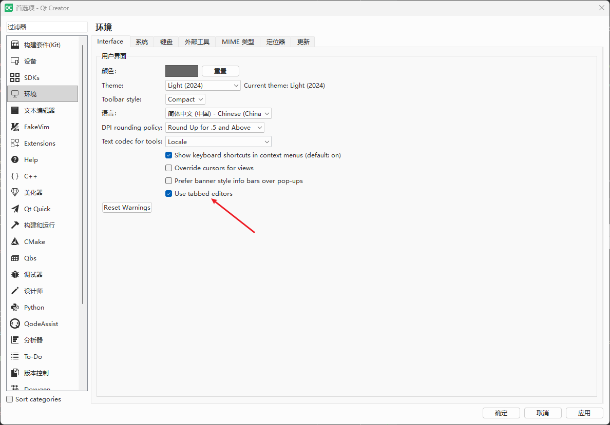
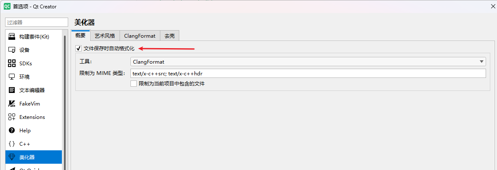
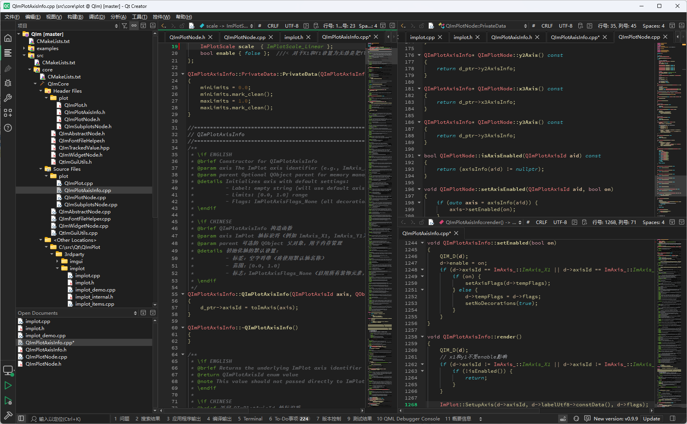

# Qt开发环境

开发Qt用哪个IDE一直有争议，目前有很多种搭配方案：

1. Qt Creator
2. Visual Studio
3. Visual Studio Code
4. CLion

这个问题在知乎等平台上有很多讨论，例如：[推荐用什么软件写Qt？](https://www.zhihu.com/question/532047670), 我使用过`Qt Creator`、`Visual Studio`、`Visual Studio Code`, 选哪种看个人电脑配置和对AI提示的需求上。

低配电脑，可以选择`Qt Creator 4.0`以下版本，有很快捷的编码体验，编码跳转帮助都很流畅，但无论什么情况，调试都比不过`Visual Studio`, 目前没有任何方案调试能比用`Visual Studio`优秀。

如果你电脑配置较高，可以选用`Qt Creator 18.0`及以上，它的编码跳转能力比`Visual Studio`优秀，尤其开启内置的tab标签页，大批量代码编码和doxygen注释的支持都非常优秀。

关于AI，`Qt Creator 18.0`及以上可以安装`QodeAssist`配置AI提示，你可以自己搭建`Ollama + Qwen-Coder`方案实现离线AI提示，普通个人电脑，使用`Ollama+Qwen2.5-Coder 7B`足够进行AI代码补全，如果不想折腾，建议使用`Visual Studio`或`VSCode`安装通义灵码(VS2019以上才支持)等免费的AI插件实现AI提示

但无论哪种，调试体验还是`Visual Studio`最好，我经常使用`Qt Creator`编码+`Visual Studio`调试的方案

如果你使用`Qt Creator`，我建议你使用18.0以上版本，并进行如下配置：

1. 开启Tabbed Editor，工具栏样式选择紧凑样式(Compact)

	

2. 下载MiniMap插件，实现类似VSCode的代码地图导航
	
	这点根据个人喜好可选，电脑屏幕太窄可以不开启
	 
3. 配置clang-format，并开启保存自动格式化功能
	
	
	
通过上面设置你的`Qt Creator`会有更好的体验，支持tab标签、有代码地图、自动格式化代码，也可以携带AI插件

!!! note "内网AI编程建议"
    如果你是在内网开发，尤其涉及军工，无法连接外网的AI，非常建议通过`Ollama + Qwen-Coder`等方案搭建本地AI提示

`Qt Creator`和开发Qt的版本无关，就是你现在依然使用Qt5, 你也可以用最新版`Qt Creator`进行开发

## `Qt Creator`配置Qt版本

上面说道，`Qt Creator`是一个IDE，它并不和Qt的版本绑定，你电脑可以安装多个Qt版本，用一个`Qt Creator`来开发

## 添加C++标准库帮助文档

`Qt Creator`的优势之一是有很完备的文档，cppreference官网有c++标准qch文档下载，你可以去[https://en.cppreference.com/w/Cppreference%253AArchives.html](https://en.cppreference.com/w/Cppreference%253AArchives.html)，官网的内容比较旧，最新版是由PeterFeicht在github上维护，你可以去[https://github.com/PeterFeicht/cppreference-doc/releases](https://github.com/PeterFeicht/cppreference-doc/releases)这个地址下载最新版的qch文档

下载后的qch文档，可以在`Qt Creator`中添加，通过[编辑]->[Preference]->选中Help选项，选择文档标签，点击添加，把qch文档加入，这样你就可以直接在代码里按F1查看标准库的说明文档里

任何支持doxygen注释的库都可以生成qch文档，可以把自己开发的库生成qch文档，在项目团队里统一使用，这样开发人员就可以直接查看库文档，这对于大型项目开发尤为重要，这也是为什么我推荐使用`Qt Creator`的原因之一

## 更新`Qt`

MaintenanceTool.exe