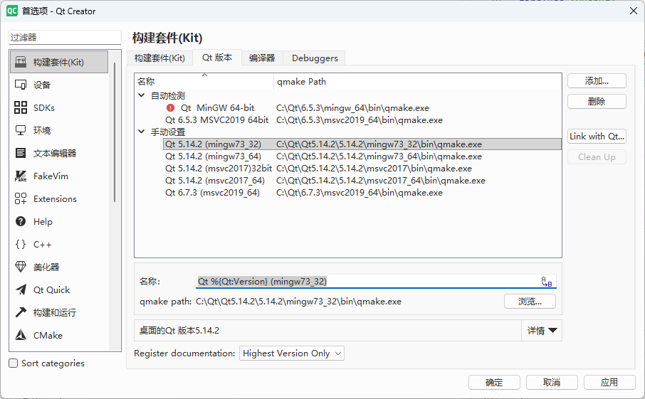
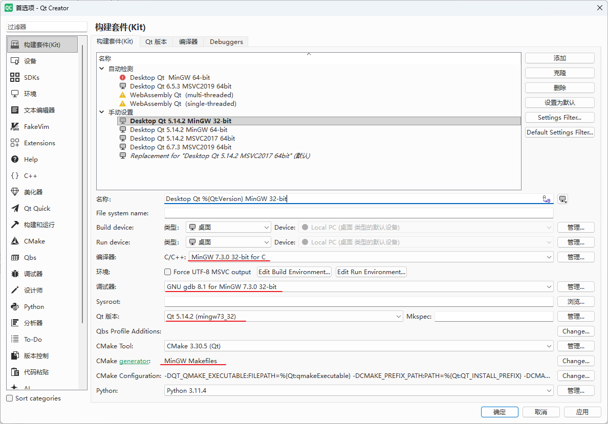
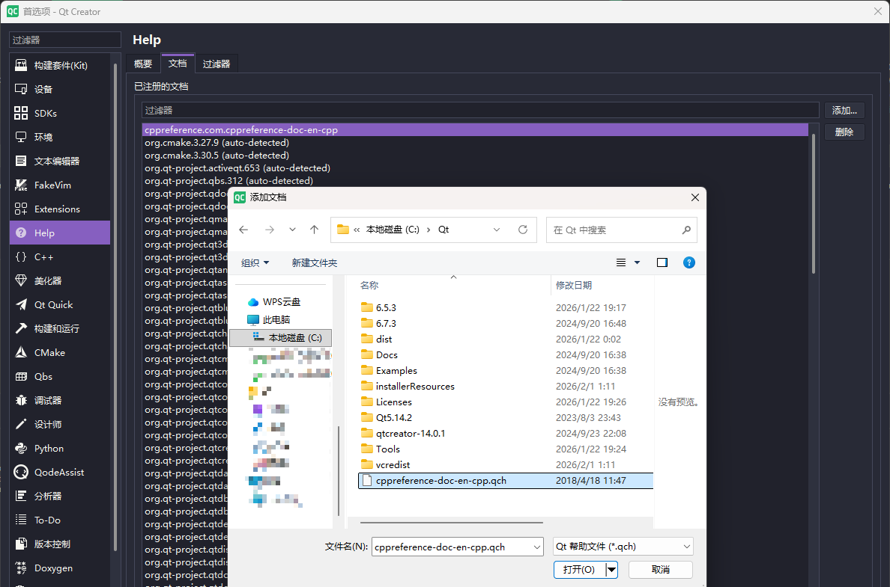

# Qt开发环境

开发Qt用哪个IDE一直有争议，目前有很多种搭配方案：

1. Qt Creator
2. Visual Studio
3. Visual Studio Code
4. CLion

这个问题在知乎等平台上有很多讨论，例如：[推荐用什么软件写Qt？](https://www.zhihu.com/question/532047670), 我使用过`Qt Creator`、`Visual Studio`、`Visual Studio Code`, 选哪种看个人电脑配置和对AI提示的需求上。

低配电脑，可以选择`Qt Creator 4.0`以下版本，有很快捷的编码体验，编码跳转帮助都很流畅，但无论什么情况，调试都比不过`Visual Studio`, 目前没有任何方案调试能比用`Visual Studio`优秀。

如果你电脑配置较高，可以选用`Qt Creator 18.0`及以上，它的编码跳转能力比`Visual Studio`优秀，尤其开启内置的tab标签页，大批量代码编码和doxygen注释的支持都非常优秀。

关于AI，`Qt Creator 18.0`及以上可以安装`QodeAssist`配置AI提示，你可以自己搭建`Ollama + Qwen-Coder`方案实现离线AI提示，普通个人电脑，使用`Ollama+Qwen2.5-Coder 7B`足够进行AI代码补全，如果不想折腾，建议使用`Visual Studio`或`VSCode`安装通义灵码(VS2019以上才支持)等免费的AI插件实现AI提示

> 关于`Qt Creator`配置`QodeAssist`可参见：[搭建QtCreator的AI编程环境](./搭建QtCreator的AI编程环境.md)

但无论哪种，调试体验还是`Visual Studio`最好，我经常使用`Qt Creator`编码+`Visual Studio`调试的方案

自从`CMake`成为C++的构建主流，开发C++项目不受限于某个IDE，Qt Creator、visual studio、CLion、VS Code，都可以加载`CMake`作为项目进行构建，而不是面对各自IDE的特殊格式，这也是CMake的一大贡献之一，把混乱的C++构建生态基本统一了

我比较推荐2种开发方式，一种是`Qt Creator`，另外一种是`VS Code`，下面分别介绍

## 使用`Qt Creator`开发环境

如果你使用`Qt Creator`，我建议你使用18.0以上版本

`Qt Creator`作为开发环境，建议进行如下配置：

1. 开启Tabbed Editor，工具栏样式选择紧凑样式(Compact)

    

2. 下载MiniMap插件，实现类似VSCode的代码地图导航

    这点根据个人喜好可选，电脑屏幕太窄可以不开启
  
3. 配置`clang-format`，并开启保存自动格式化功能

    

通过上面设置你的`Qt Creator`会有更好的体验，支持tab标签、有代码地图、自动格式化代码，也可以携带AI插件


!!! note "内网AI编程建议"
    如果你是在内网开发，尤其涉及军工，无法连接外网的AI，非常建议通过`Ollama + Qwen-Coder`等方案搭建本地AI提示，详见：[搭建QtCreator的AI编程环境](./搭建QtCreator的AI编程环境.md)

`Qt Creator`和开发Qt的版本无关，你现在依然使用Qt5, 你也可以用最新版`Qt Creator`进行开发

### `Qt Creator`配置Qt版本

上面说道，`Qt Creator`是一个IDE，它并不和Qt的版本绑定，你电脑可以安装多个Qt版本，用一个`Qt Creator`来开发

你电脑可以安装多个版本的qt，在`Qt Creator`中添加Qt版本，通过[编辑]->[Preference]->选中`构建套件`选项，选择`Qt版本`标签

这里会有默认识别的qt版本，你可以点击`Link With Qt`按钮，选择Qt安装的根目录（Qt安装的根目录是指`MaintenanceTool.exe`所在的目录），它会自动识别所有存在的Qt版本



有了Qt版本，就可以添加Qt构建套件了，通过`构建套件(Kit)`标签，选择`Qt构建套件`标签，点击添加，选择你添加的Qt版本以及对应的编译器即可配置



### 添加C++标准库帮助文档

`Qt Creator`的优势之一是有很完备的文档，cppreference官网有c++标准qch文档下载，你可以去[https://en.cppreference.com/w/Cppreference%253AArchives.html](https://en.cppreference.com/w/Cppreference%253AArchives.html)，官网的内容比较旧，最新版是由PeterFeicht在github上维护，你可以去[https://github.com/PeterFeicht/cppreference-doc/releases](https://github.com/PeterFeicht/cppreference-doc/releases)这个地址下载最新版的qch文档

下载后的qch文档，可以在`Qt Creator`中添加，通过[编辑]->[Preference]->选中[Help选项]，选择[文档]标签，点击添加，把qch文档加入，这样你就可以直接在代码里按F1查看标准库的说明文档



任何支持doxygen注释的库都可以生成qch文档，可以把自己开发的库生成qch文档，在项目团队里统一使用，这样开发人员就可以直接查看库文档，这对于大型项目开发尤为重要，这也是使用`Qt Creator`的优势

### 快捷键

要高效使用`Qt Creator`，你需要知道如下快捷键，你的编码效率会极大提高：

- `F4` 切换头文件和源文件
- `F3` 跳转到引用
- `F1` 打开光标处的文档

## 使用`VS Code`开发环境

`VS Code`也是一个很优秀的开发环境，尤其在AI加持下，`VS Code`可以使用更好的AI提示，体验比`QodeAssist`更优秀（至少截止2026年2月，`QodeAssist`的效果还无法和`VS Code`比），且不需要花钱购买token

`VS Code`有丰富的插件生态，使用`VS Code`首先需要安装如下插件：

- `C/C++`插件
- `C/C++ Extension Pack`插件
- `CMake Tools`插件
- `Qt C++ Extension Pack`插件(包含了`Qt C++`、`Qt Core`、`Qt Qml`、`Qt UI`4个插件)

上面配置好后，即可直接开发

`VS Code`还有很多优秀的插件辅助开发，这里就不介绍，可以自行搜索

## 更新`Qt`

Qt的安装目录下有自动更新的工具：`MaintenanceTool.exe`，你只要在线安装过一次，后续所有的更新都可以通过此工具完成

国内可以设置镜像进行快速下载，你可以这样运行`MaintenanceTool.exe`：

```bash
MaintenanceTool.exe --mirror http://mirrors.ustc.edu.cn/qtproject
```
