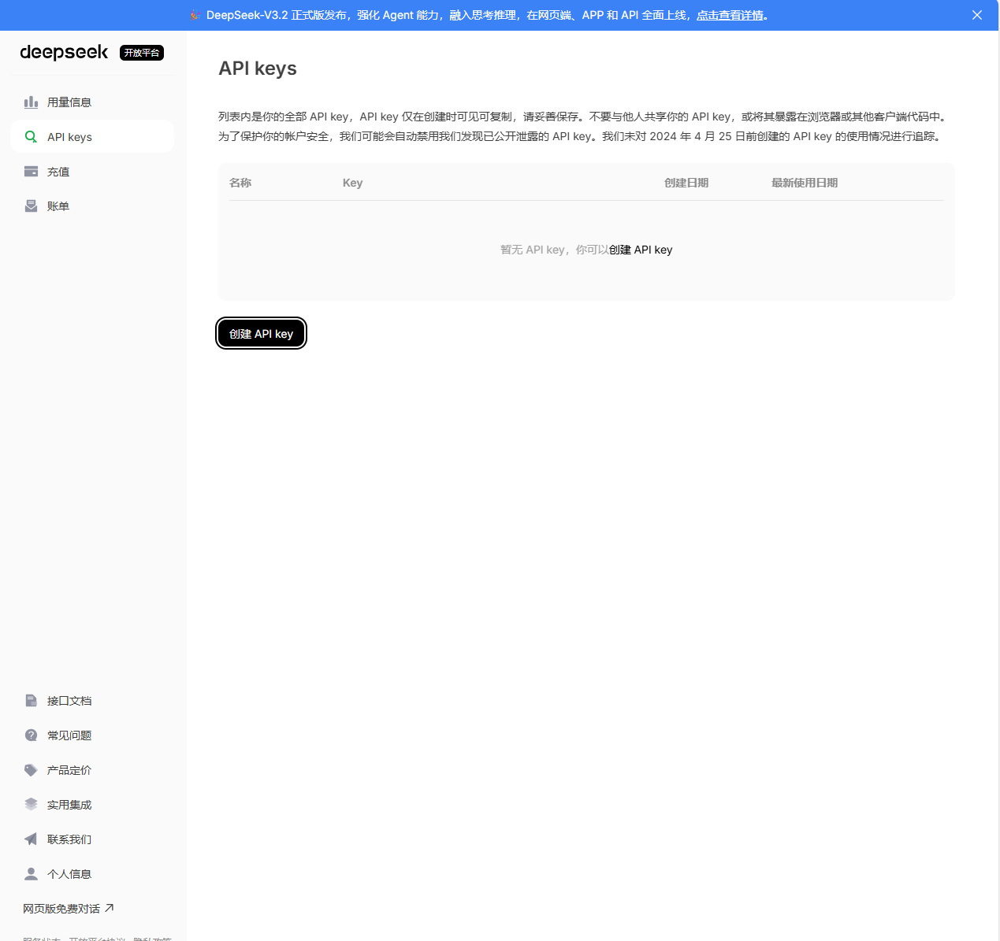
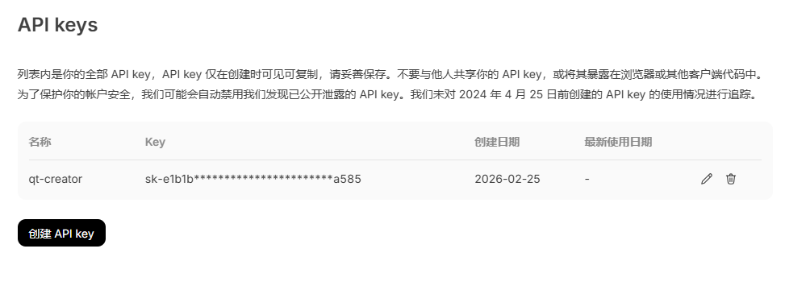
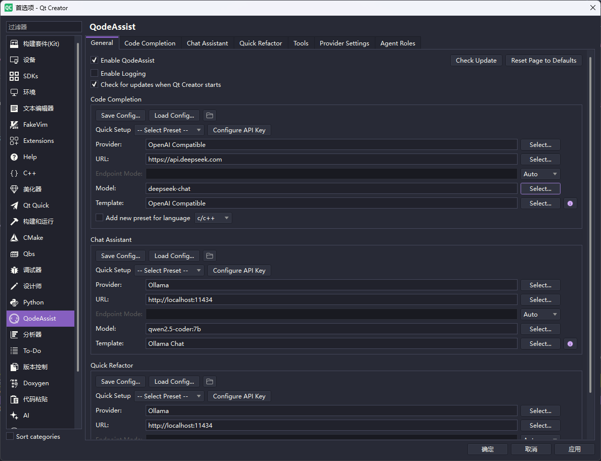

# 搭建`Qt Creator`的AI编程环境

Qt Creator从17版本开始支持ai插件，官方有AI Assistant，这个插件需要商业授权才可以使用，开源版可以使用社区版的`QodeAssist`，下面介绍如何通过`QodeAssist`来搭建`Qt Creator`的AI编程环境。

## 安装QodeAssist

首先去github上下载`QodeAssist`，[QodeAssist github地址](https://github.com/Palm1r/QodeAssist)

可以在发行版里选择最新的下载：[QodeAssist releases](https://github.com/Palm1r/QodeAssist/releases)

下载后解压，将`QodeAssist.dll`放到`QtCreator/lib/qtcreator/plugins`目录下

重启`Qt Creator`,在设置页即可看到此插件的配置内容

## APIkey申请

`QodeAssist`需要先申请APIkey，这里以`Deepseek`为例，需要先去[deepseek的开发官网](https://platform.deepseek.com/)申请APIkey。

申请后你需要给当前apikey起个名字，并记下Apikey。最后邮件发给自己，或者用个记事本记录下来，这个key在官网是无法查找到

获取到apikey后，就可以开始搭建AI编程环境了

## 搭建AI编程环境

`deepseek`的API兼容`OpenAI Compatible API`,因此，配置的时候，把它当做`OpenAI Compatible`来配置即可

在代码补全页面(Code Completion)，进行如下配置

| 参数 | 值 |
| --- | --- |
| Provider | 选择:OpenAI Compatible |
| URL | 填写:<https://api.deepseek.com> |
| Model | 填写:deepseek-chat|
| Template |选择:OpenAI Compatible|

`Chat Assistant`填写可以和上面一样

另外还需要配置`Provider Setting`，把`OpenAI Compatible`对应的`API Key`填入之前申请的`deepseek`的`apikey`

操作完成上面的步骤后即可使用`QodeAssist`进行AI代码补全

可以通过`Ctrl`+`Alt`+`Q`来触发补全，总体效果速度一般，没有通义灵码快捷方便的，但是对于快速编码还是比原来的自动补全要好很多
